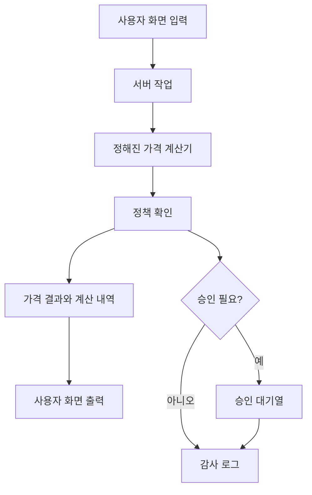
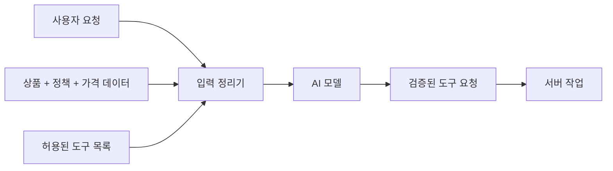
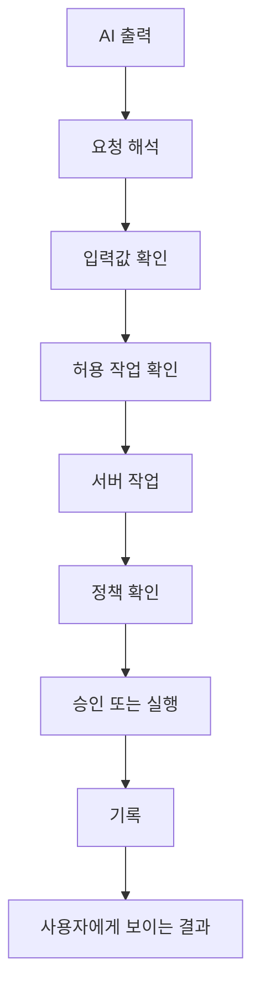

# Global AI Pricing

`global-ai-pricing`은 글로벌 패션 커머스 상황을 가정한 가격 산정 및 AI 보조 운영 프로토타입입니다.

이 프로젝트의 핵심 질문은 "AI에게 가격을 물어보면 되는가?"가 아닙니다. 오히려 반대에 가깝습니다. 가격, 세금, 관세, 배송비, 마진처럼 나중에 설명할 수 있어야 하는 일은 AI의 답변에 맡기지 않고, 정해진 규칙과 계산기로 처리해야 합니다.

AI는 사람의 요청을 읽고 정리하는 데 강합니다. 하지만 최종 가격을 정하거나, 승인 없이 중요한 작업을 실행하는 역할을 맡기면 위험합니다. 이 레포는 AI를 똑똑한 보조자로 쓰되, 실제 계산과 실행은 검증 가능한 코드와 정책으로 통제하는 구조를 보여줍니다.

## 프로젝트 목적

이 프로젝트는 다음을 보여주는 것을 목표로 합니다.

- 여러 국가와 통화를 다루는 글로벌 가격 계산 구조
- 환율, 세금, 관세, 배송비, 마진 정책을 반영하는 가격 비교 UI
- AI가 상품 정보를 정리하고 계산을 요청하는 보조 흐름
- 중요한 변경은 바로 실행하지 않고 승인 요청으로 넘기는 구조
- 어떤 입력으로 어떤 가격이 나왔는지 나중에 추적할 수 있는 감사 로그

첫 구현은 SQLite와 Drizzle ORM으로 작게 시작합니다. 다만 데이터 접근 계층을 분리해, 나중에 PostgreSQL로 옮기더라도 가격 계산 로직을 크게 바꾸지 않는 구조를 지향합니다.

## 핵심 원칙

가격 계산은 다시 돌려도 같은 답이 나와야 합니다.

같은 상품, 같은 환율, 같은 세금 규칙, 같은 마진 정책을 넣었다면 결과도 같아야 합니다. 그리고 사용자는 최종 가격만 보는 것이 아니라, 왜 그 가격이 나왔는지도 볼 수 있어야 합니다.

```text
명시적인 입력값
  -> 정해진 가격 계산기
  -> 정책 확인
  -> 승인 필요 여부 판단
  -> 계산 내역과 감사 로그 기록
```

AI는 이 흐름에서 요청을 해석하고 설명을 돕습니다. 하지만 AI가 세율을 지어내거나, 가격 계산기를 건너뛰거나, 승인 없이 중요한 변경을 실행해서는 안 됩니다.

## 사용자 UI 입력에서 출력까지

초기 사용자 흐름은 다음과 같습니다.

1. 사용자가 상품을 입력하거나 선택합니다.
2. 출발 국가와 도착 국가를 선택합니다.
3. 시스템이 환율, 세금, 관세, 배송비, 가격 정책을 불러옵니다.
4. 가격 계산기가 예상 판매가와 계산 내역을 만듭니다.
5. 화면에는 최종 가격, 계산 근거, 가정, 경고, 정책 버전이 함께 표시됩니다.
6. AI는 상품 정보를 정리하거나 가격 계산을 요청할 수 있습니다.
7. 정책 기준을 넘는 작업은 승인 요청으로 전환됩니다.
8. 승인된 작업은 실행되고 기록으로 남습니다.



## 첫 번째 구현 단위

초기 데모는 외부 사이트에 매번 접속하지 않고, 미리 저장해 둔 공개 상품 샘플 데이터에서 시작합니다.

첫 상품 예시는 다음과 같습니다.

```text
Source: UNIQLO US
Product: Women's Cotton Oversized Short-Sleeve T-Shirt
Product ID: 456009
Source market: United States
Destination market: Korea
```

첫 구현에서는 이 상품 샘플을 정리하고, USD 가격과 배송 정보에 미리 준비한 환율, 관세, VAT, 국내 배송비, 마진 정책을 결합해 한국 도착 기준의 예상 최종 가격을 보여줍니다.

라이브 웹페이지 수집기는 이후 단계에서 붙입니다. 테스트는 외부 웹사이트 상태에 흔들리지 않도록 저장된 샘플 데이터를 기준으로 동작해야 합니다.

첫 상품은 UNIQLO 전용 예외 코드가 아니라, 여러 상품으로 확장할 수 있는 공통 상품 구조의 첫 사례로 다룹니다. 상품 ID나 브랜드별 세부 정보는 fixture, 정규화 계층, scraper adapter에 머물러야 하며, 가격 계산기는 특정 상품을 알지 못한 채 명시적인 가격 입력만 받아 계산해야 합니다.

## AI에게 전달하는 입력 정리

AI에게 아무 정보나 길게 던지면 결과가 흔들릴 수 있습니다. 그래서 이 프로젝트에서는 AI에게 줄 정보를 항목별 신청서처럼 정리합니다.

AI에게 전달하는 정보는 크게 다음과 같습니다.

- 사용자가 원하는 일: 어떤 상품을 어느 국가 기준으로 계산하려는지
- 상품 정보: 상품명, 브랜드, 원래 가격, 통화, 출처, 수집 시점
- 정책 정보: 적용할 가격 정책, 승인 기준, 차단 조건
- 계산 정보: 환율, 세금, 관세, 배송비, 마진, 할인, 반올림 규칙
- 사용 가능한 도구: AI가 요청할 수 있는 제한된 작업 목록
- 금지 조건: 세율을 지어내지 말 것, 가격 계산기를 건너뛰지 말 것, 승인 없이 실행하지 말 것

AI는 이 정보를 보고 직접 데이터베이스를 고치지 않습니다. 이 프로젝트는 LLM이 SQL을 생성해 실행하는 text-to-SQL 구조가 아니라, 정해진 도구를 호출하는 tool calling 구조를 사용합니다. AI는 "상품 정보를 정리해 줘", "가격을 계산해 줘", "승인 요청을 만들어 줘" 같은 허용된 요청만 할 수 있습니다. 실제 데이터 조회, 변경, 계산, 승인은 서버 코드가 맡습니다.



## AI 출력 검문소

AI가 내놓은 답은 바로 실행하지 않습니다. 먼저 검문소를 통과해야 합니다.

여기서 검문소는 AI 출력이 안전한지 확인하고, 허용된 일만 실제 시스템에 연결하는 보호 장치입니다. 전문 용어로는 이런 계층을 하니스라고 부를 수 있습니다.

검문소는 다음을 확인합니다.

- AI가 요청한 작업이 허용된 작업인지
- 필요한 값이 빠지지 않았는지
- 값의 형식이 맞는지
- 가격 계산은 정해진 가격 계산기로 가는지
- 데이터 변경 요청은 정책 확인을 거치는지
- 민감한 작업은 승인 요청으로 넘어가는지
- 요청, 결과, 실패, 경고가 기록되는지



이 구조의 목적은 AI의 장점인 해석과 설명 능력은 활용하되, 실행 권한과 가격 결정권은 사람이 검토할 수 있는 코드와 정책 안에 묶어두는 것입니다.

## 규칙 기반 자동화

이 프로젝트의 자동화는 AI의 감에 맡기지 않고, 미리 정한 규칙을 중심으로 설계합니다.

예를 들어 다음 조건은 자동으로 승인 요청, 차단, 경고 상태를 만들 수 있습니다.

- 가격 변경 폭이 10%를 넘으면 승인 필요
- 최소 마진보다 낮으면 승인 또는 거절 필요
- 세금, 관세, 환율 데이터가 없거나 오래되었으면 실행 차단
- 새 상품 카테고리 제안은 검토 필요
- 주문, 정산, 가격 변경은 감사 로그 필수

작업 상태의 흐름도 서버에서 확인합니다.

```text
DRAFT
  -> VALIDATED
  -> PENDING_APPROVAL
  -> APPROVED
  -> EXECUTED
```

실행 가능한 작업도 실패할 수 있으므로, 실패 역시 기록에 남겨야 합니다.

## 기술 방향

초기 기술 방향은 다음과 같습니다.

- Next.js
- React
- TypeScript strict mode
- Tailwind CSS
- shadcn/ui
- lucide-react
- SQLite
- Drizzle ORM
- Zod
- Vitest
- Playwright
- GCP Gemini API

언어모델 제공자와 모델명은 adapter와 환경변수 뒤에 둡니다. 특정 Gemini 모델명이 코드 전체에 흩어지지 않도록 합니다.

## 글로벌 UI

초기 지원 언어는 다음 다섯 가지입니다.

```text
ko / en / ja / zh / ar
```

언어별 URL route를 사용하되, 페이지 전체를 언어별로 복제하지 않고 공유 UI 문구는 i18n key로 관리합니다. `ja`, `zh`는 언어 route에 사용하고, `jp`, `cn` 같은 코드는 국가 또는 market data를 표현할 때만 사용합니다.

Arabic RTL, 긴 번역 문자열, 통화 및 날짜 포맷, 모바일 비교 UI는 초기 설계에서 함께 고려합니다.

## 디자인 방향

디자인 방향은 `Neo Brutal Data Utility`입니다.

화려한 랜딩 페이지보다 가격 비교와 계산 근거 확인에 적합한 대시보드형 UI를 우선합니다. 강한 border, 작은 radius, 제한적인 shadow, 명확한 테이블과 필터를 사용해 정보를 빠르게 비교할 수 있게 만듭니다.

자세한 디자인 규칙은 `DESIGN.md`를 기준으로 합니다.

## 문서

- `AGENTS.md`: 작업 규칙과 프론트엔드 변경 시 지켜야 할 기준
- `DESIGN.md`: UI/UX 디자인 시스템 방향
- `implementation_plan.md`: 구현 범위, 아키텍처, 마일스톤 계획

## 프로젝트 성공 기준

이 프로젝트는 다음을 보여줄 수 있으면 성공입니다.

- 같은 입력과 같은 정책 버전은 같은 계산 결과를 만든다.
- 가격 계산 결과는 계산 내역, 가정, 경고, 버전과 함께 설명된다.
- AI는 가격 계산기와 승인 정책을 우회할 수 없다.
- 민감한 변경은 승인 흐름과 감사 로그를 남긴다.
- 사용자는 화면에서 입력부터 계산 결과, 승인 상태까지 흐름을 이해할 수 있다.
