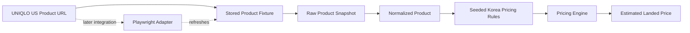
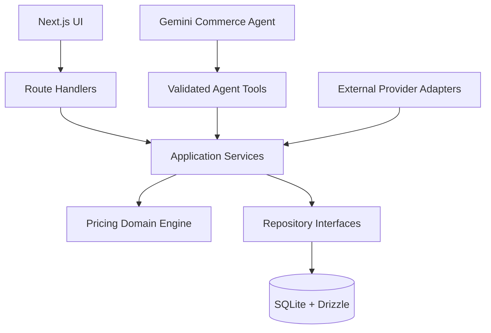
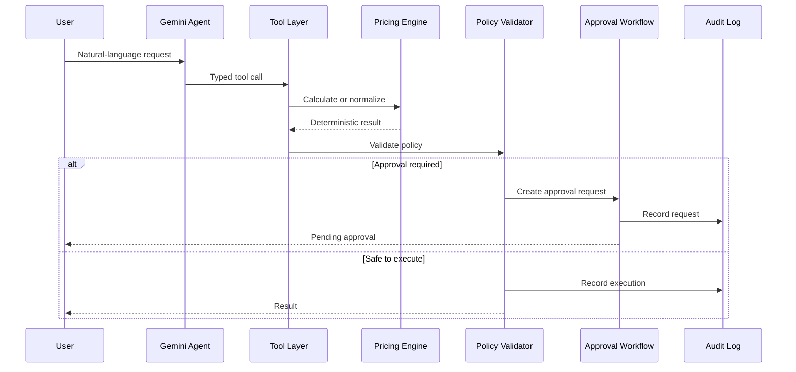
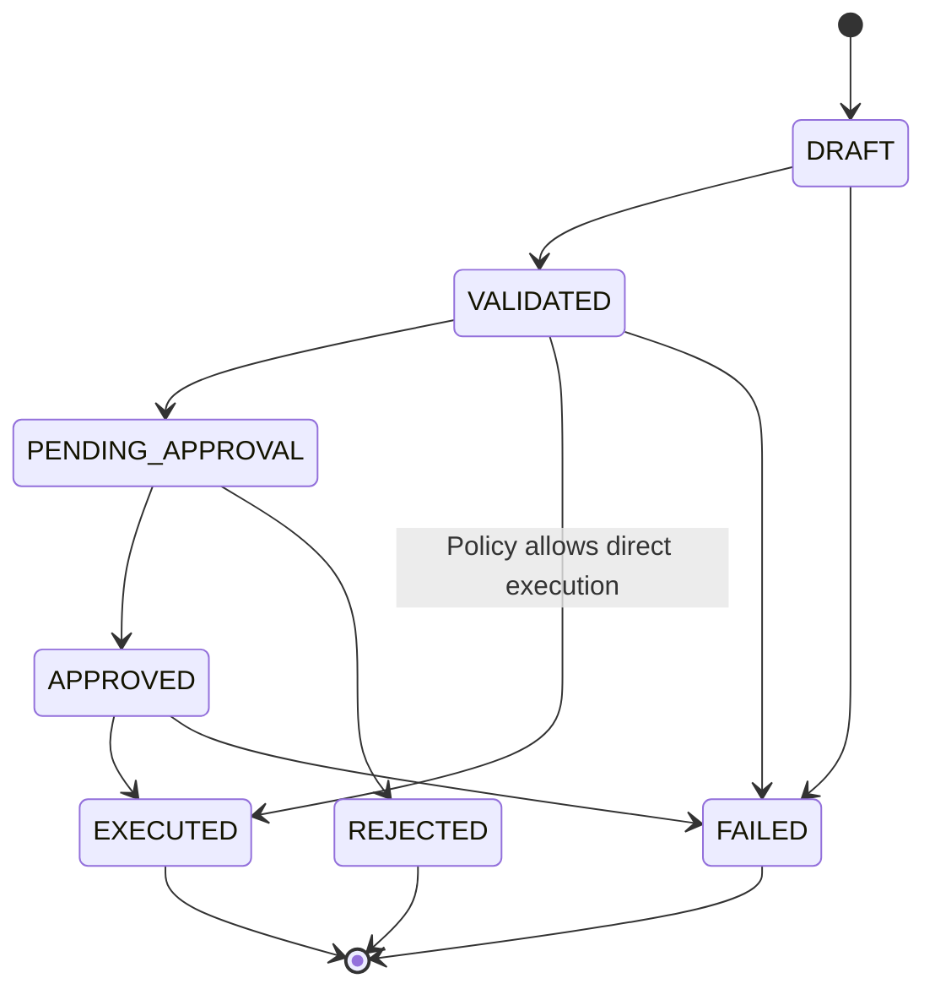
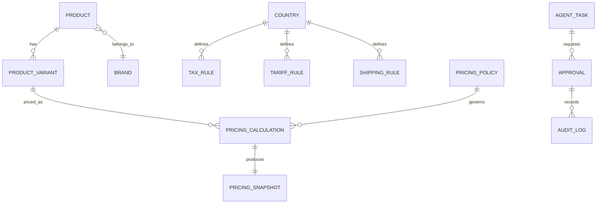

# Global AI Pricing — Implementation Plan

## 1. Project Objective

`global-ai-pricing` is a portfolio and interview-preparation project for a global fashion commerce platform.

The project demonstrates how to build:

- A deterministic global pricing engine
- A multi-country, multi-currency commerce interface
- An AI Commerce Agent using tool calling
- Human approval and auditability for AI-assisted operations
- A small but realistic product-development and experimentation workflow

The central design principle is:

> Pricing rules must be deterministic and auditable. AI may interpret requests, normalize data, suggest actions, and request approval, but it must not arbitrarily determine final prices or execute sensitive operations without policy validation.

The initial implementation will use SQLite and Drizzle ORM for speed and simplicity. Database access must be isolated so that PostgreSQL can be introduced later without redesigning the domain layer.

The AI layer will use the existing GCP Gemini API setup and the currently used lightweight Gemini Flash model. The model name and provider-specific code must be isolated behind an adapter so that the model can be changed later.

---

## 2. Target Product Scope

### 2.1 Initial user flow

1. The user enters or selects a product.
2. The user selects a source country and destination country.
3. The system loads exchange-rate, tax, tariff, shipping, and pricing-policy data.
4. The Pricing Engine calculates a recommended sale price.
5. The UI shows the result and a detailed calculation breakdown.
6. The AI Agent can normalize product information or request a price calculation through tools.
7. If a policy threshold is exceeded, the system creates an approval request.
8. Approved actions are executed and recorded in the audit log.

### 2.2 Initial screens

- Global pricing dashboard
- Product input and product draft screen
- Country and currency selector
- Price comparison table
- Calculation breakdown and assumptions panel
- Pricing-policy and engine-version metadata panel
- AI Agent workspace
- Approval queue
- Audit-log viewer
- Basic experiment/event dashboard

The first screen should remain a usable dashboard or comparison tool rather than a marketing landing page.

### 2.3 One-product fixture-first vertical slice

To demonstrate a realistic external-data path without turning this project into a general-purpose crawler, implement the first vertical slice from a stored public-product fixture first. Add the Playwright scraper after the deterministic pricing flow is working from that fixture.

Recommended first product:

```text
Source: UNIQLO US
Product: Women's Cotton Oversized Short-Sleeve T-Shirt
Product ID: 456009
URL: https://www.uniqlo.com/us/en/products/E456009-000/00
Source market: United States
Destination market: Korea
```

This product is a good first target because the public product page exposes a relatively small and understandable set of fields:

- Product name
- Product ID
- Price and USD currency
- Product material
- Production country
- Shipping fee and free-shipping threshold
- Availability and product description

The current price must not be hard-coded as a business rule. The initial fixture should preserve the observed price, currency, source URL, source timestamp, and raw extracted fields. The later scraper should capture the price at run time and persist the collection timestamp. Product availability, price, shipping, and page structure may change.

The first vertical slice will load the stored public-product fixture, normalize the result, combine it with seeded exchange-rate, tariff, VAT, and domestic-shipping rules, and display a transparent estimated landed price for Korea. The Playwright scraper is an integration demonstration added after this fixture-based path is stable.

The project should describe this as an **estimated calculation**, not as an official customs determination. Apparel tariff treatment may depend on classification, material, origin, value, and applicable trade rules.



The first scraper must not attempt to collect wholesale prices, login-only data, checkout data, customer data, or data from multiple sites. Wholesale pricing is often unavailable publicly and would add unnecessary authentication, contractual, and data-quality complexity.

---

## 3. Technology Baseline

### Frontend

- Next.js
- React
- TypeScript with strict mode
- Tailwind CSS
- shadcn/ui
- lucide-react
- `next-intl` or the existing i18n implementation
- React Hook Form where form complexity justifies it
- TanStack Query where server-state management is needed
- URL-based state for filters, country, currency, and comparison settings where practical

### Backend and application layer

- Next.js Route Handlers initially
- TypeScript application services
- Zod for request and response validation
- Provider and adapter interfaces for external services

### Database

- SQLite for the initial prototype
- Drizzle ORM
- Drizzle migrations
- Seed data for countries, currencies, products, tax rules, shipping rules, exchange rates, and policies

The database layer must not leak into the domain layer. The intended future migration path is:

```text
SQLite + Drizzle
        ↓
PostgreSQL + Drizzle
```

### AI

- GCP Gemini API
- Existing lightweight Gemini Flash model configuration
- Tool calling / function calling
- Provider adapter isolating Gemini-specific code

Suggested abstraction:

```ts
interface LlmProvider {
  generate(input: AgentInput, tools: AgentTool[]): Promise<AgentResponse>
}
```

The model name must be configured through an environment variable and must not be hard-coded throughout the application.

### Testing and operations

- Vitest for domain and application tests
- Playwright for critical browser flows
- Structured application logging
- Sentry or an equivalent error-reporting adapter later
- PostHog or a small internal event table for initial product analytics

Production build and deployment are manual and must not be run automatically during ordinary feature work.

---

## 4. Architecture

The application should follow a layered structure:

```text
UI / Next.js pages
        ↓
Route handlers / server actions
        ↓
Application services
        ↓
Domain services
        ↓
Repository interfaces
        ↓
Drizzle repositories
        ↓
SQLite
```

The AI Agent must call application tools rather than directly manipulating the database.

### 4.1 System architecture



The Agent and the UI share application services, but neither is allowed to bypass domain validation or repositories.

```text
User request
    ↓
Gemini Agent
    ↓
Validated tool call
    ↓
Application service
    ↓
Pricing Engine or commerce workflow
    ↓
Policy validation
    ↓
Approval when required
    ↓
Execution
    ↓
Audit log
```

### 4.2 Suggested project structure

```text
src/
  app/
    [locale]/
      dashboard/
      pricing/
      agent/
      approvals/
      audit-logs/
  components/
  domain/
    pricing/
      calculate-price.ts
      money.ts
      exchange-rate.ts
      tax-rules.ts
      tariff-rules.ts
      shipping-rules.ts
      pricing-policy.ts
      types.ts
  application/
    pricing/
    products/
    approvals/
    agent/
  infrastructure/
    scraping/
      types.ts
      product-scraper.ts
      uniqlo-us-scraper.ts
      selectors.ts
      scraper-errors.ts
    db/
      schema.ts
      client.ts
      repositories/
      seed.ts
    llm/
      llm-provider.ts
      gemini-provider.ts
    external/
      exchange-rate-provider.ts
      shipping-provider.ts
      payment-provider.ts
      partner-catalog-provider.ts
  agent/
    tools/
    prompts/
    executor.ts
  lib/
    validation/
    i18n/
    events/
```

The exact directory names may change, but domain logic, application logic, infrastructure, and UI responsibilities must remain distinguishable.

### 4.3 Agent execution flow



---

## 5. Pricing Engine

### 5.1 Pricing inputs

The engine should accept explicit, versioned inputs:

```ts
type PricingInput = {
  productCost: Money
  sourceCountry: CountryCode
  destinationCountry: CountryCode
  shippingCost: Money
  tariffRate: Rate
  vatRate: Rate
  exchangeRate: ExchangeRate
  paymentFeeRate: Rate
  targetMarginRate: Rate
  discountRate?: Rate
  pricingPolicyVersion: string
}
```

### 5.2 Pricing outputs

The result must contain more than a final number.

```ts
type PricingResult = {
  recommendedPrice: Money
  breakdown: PriceComponent[]
  assumptions: PricingAssumption[]
  warnings: PricingWarning[]
  engineVersion: string
  policyVersion: string
  calculatedAt: string
}
```

### 5.3 Required calculation concepts

- Decimal arithmetic; do not use JavaScript floating-point arithmetic for money
- Currency-aware formatting and minor-unit rules
- Explicit order of tariff and VAT calculation
- Exchange-rate basis and timestamp
- Shipping-cost rules
- Margin and discount rules
- Country-specific rounding
- Tax-free or duty-free thresholds
- Calculation warnings when data is missing or approximate
- Versioned pricing policies
- Reproducible calculation snapshots

The UI must show the calculation basis, not only the final recommended price.

### 5.4 Pricing test cases

At minimum, cover:

- Korea, Japan, and United States destinations
- Multiple source currencies
- Exchange-rate changes
- Duty-free threshold
- High-value product
- Free and paid shipping
- Different margin policies
- Discount application
- Currency rounding
- Missing or stale exchange-rate data
- Policy-version changes

---

## 6. Initial Database Model

The first schema should be intentionally small. Start with the core tables needed to calculate, display, snapshot, approve, and audit the first pricing flow:

- `products`
- `brands`
- `product_variants`
- `countries`
- `currencies`
- `exchange_rates`
- `tax_rules`
- `tariff_rules`
- `shipping_rules`
- `pricing_policies`
- `pricing_calculations`
- `pricing_snapshots`
- `approvals`
- `audit_logs`

Add these later, after the core pricing and approval flow is demonstrable:

- `agent_tasks`
- `events`

### 6.1 Important persistence rules

- Preserve the original external product payload in JSON where appropriate.
- Store calculation inputs and outputs as a reproducible snapshot.
- Store engine and policy versions with every calculation.
- Store actor, timestamp, action, and before/after values in audit logs.
- Use stable IDs and timestamps.
- Use an idempotency key for operations that may be retried.

SQLite-specific implementation shortcuts are allowed in infrastructure code only. Business rules must remain portable.

---

## 7. AI Commerce Agent

### 7.1 Initial tools

Implement tools in this order:

1. `normalize_product_data`
2. `calculate_price`
3. `request_price_approval`
4. `create_product_draft`
5. `suggest_category`
6. `update_product_price`
7. `create_order_draft`

The first milestone only needs the first three tools.

### 7.2 Tool rules

- Every tool has a Zod input schema.
- Every tool returns a typed result.
- Tools call application services, not raw database queries.
- Pricing tools use the deterministic Pricing Engine.
- Sensitive mutations require policy validation.
- Mutations must be idempotent where possible.
- The agent must distinguish proposal from execution.
- Tool calls and their results must be logged.

### 7.3 Agent behavior

The Agent may:

- Interpret a natural-language request
- Extract product and destination information
- Normalize product data
- Request a price calculation
- Explain a calculation result
- Suggest an action
- Create an approval request

The Agent may not:

- Invent tax or tariff rates
- Bypass the Pricing Engine
- Directly modify pricing tables
- Execute high-risk actions without approval
- Present an uncertain calculation as a confirmed price

---

## 8. Approval and Audit Workflow

### 8.1 State model

```text
DRAFT
  → VALIDATED
  → PENDING_APPROVAL
  → APPROVED
  → EXECUTED

Any executable state may transition to FAILED.
```

The implementation must validate allowed state transitions on the server.



### 8.2 Example approval policies

- Price change above 10% requires approval.
- Margin below the minimum policy requires approval or rejection.
- Missing tax or tariff data blocks execution.
- New product category suggestions require review.
- Order and settlement changes require an audit entry.

The approval screen should show:

- Requested action
- Agent reasoning summary
- Input data
- Calculation result
- Policy warnings
- Requesting actor
- Approve and reject actions
- Full audit history

### 8.3 Core data relationships



---

## 9. Globalization and UI Requirements

Support these locales initially:

```text
ko / en / ja / zh / ar
```

Use `ja` for Japanese and `zh` for Chinese as language codes. A country code such as `cn` may still be used separately when representing a market.

Required behavior:

- Locale-aware routes
- Shared translation keys
- Locale-aware number and currency formatting
- Currency selection independent from language selection
- Date and time-zone formatting
- Arabic RTL layout
- RTL-aware directional icons and table behavior
- Long translated strings must not break controls or tables
- Mobile comparison cards when tables become too dense

The design language remains Neo Brutal Data Utility:

- Strong 1px or 2px borders
- Compact, readable data panels
- Small corner radii
- Restrained shadows
- Neutral base palette
- Teal or blue-teal trust accent
- Consistent success, warning, and danger colors
- Tables as first-class UI

Do not introduce unrelated visual refactors.

---

## 10. Product Analytics and Experiments

Track initial events such as:

- `price_viewed`
- `price_comparison_opened`
- `calculation_breakdown_opened`
- `agent_suggestion_approved`
- `agent_suggestion_rejected`
- `product_draft_created`
- `checkout_started`

Implement one simple experiment:

- Strategy A: lower customer-facing price
- Strategy B: higher target margin

The experiment layer must record the assigned variant and outcome. It does not need to be a production-grade experimentation platform.

---

## 11. External Service Adapters

Create interfaces before connecting real external services:

```ts
interface ExchangeRateProvider {}
interface TaxProvider {}
interface ShippingProvider {}
interface PaymentProvider {}
interface PartnerCatalogProvider {}
```

Initially use mock or seeded implementations. Later implementations can connect to real APIs without changing the domain engine.

Each adapter should define behavior for:

- Timeout
- Retry
- Stale data
- Partial failure
- Unavailable provider
- Response validation

### 11.1 Playwright scraping implementation

The scraper is an infrastructure adapter and must not contain pricing rules.

Suggested interface:

```ts
interface ProductScraper {
  source: string
  scrapeProduct(url: string): Promise<ScrapedProduct>
}
```

Suggested normalized result:

```ts
type ScrapedProduct = {
  sourceUrl: string
  sourceName: string
  productName: string
  productId?: string
  brand?: string
  price: {
    amount: string
    currency: string
  }
  shippingCost?: {
    amount: string
    currency: string
  }
  freeShippingThreshold?: {
    amount: string
    currency: string
  }
  originCountry?: string
  material?: string
  availability?: string
  description?: string
  scrapedAt: string
  adapterVersion: string
  rawData?: unknown
}
```

Playwright practice scope:

- Open the public product URL.
- Wait for the product content to be available.
- Extract product name, ID, price, currency, shipping, origin, material, and availability.
- Normalize text and monetary values.
- Save a raw snapshot and a screenshot for debugging.
- Fail clearly when a required selector is missing.
- Close the browser in all success and failure paths.
- Avoid repeated requests and use a conservative timeout.

Do not bypass authentication, CAPTCHA, access controls, or rate limits. Check the target site's terms and robots guidance before using the scraper. Collect only the minimum public product information needed for this demonstration. Do not collect personal, payment, or checkout data.

### 11.2 Scraped data and pricing data boundary

The scraper provides observed facts:

```text
Observed product price
Observed currency
Observed shipping information
Observed product origin or production information
Collection time
Source URL
```

The Pricing Engine provides modeled calculations:

```text
Exchange-rate conversion
Tariff estimate
VAT estimate
Domestic shipping estimate
Margin and rounding
Recommended or estimated landed price
```

This boundary prevents a scraper from silently becoming a source of unverified tax or tariff decisions.

### 11.3 Scraping evidence

For every successful collection, preserve:

- Source URL
- Collection timestamp
- Adapter version
- Raw extracted values
- Normalized values
- Screenshot path or object identifier
- Pricing-engine version
- Exchange-rate version
- Tax/tariff policy version
- Calculation result

If a source page changes or extraction fails, the system must show a stale or unavailable state rather than silently calculating from an incorrect value.

---

## 12. Development Milestones

### Milestone 1 — Foundation

- Confirm existing Next.js structure
- Configure environment variables
- Add SQLite and Drizzle
- Add migrations and seed data
- Establish domain/application/infrastructure boundaries

### Milestone 1A — One-product fixture slice

- Add a stored UNIQLO US product fixture for product ID `456009`.
- Add the `ScrapedProduct` type or equivalent normalized source-product type.
- Normalize the observed USD price and shipping data from the fixture.
- Save or seed the raw snapshot and collection metadata.
- Ensure domain tests depend on stored fixtures, not the live website.
- Display a clear source, timestamp, and stale-data warning in the UI.

The deterministic Pricing Engine and most automated tests must run against stored fixtures so that they remain stable when the external page changes. The live scraper is an integration demonstration and should not block the first end-to-end demo.

### Milestone 2 — Deterministic Pricing Engine

- Define Money, Rate, Currency, and Country types
- Implement the calculation pipeline
- Add policy and version concepts
- Add unit tests
- Expose a calculation result through a simple application service

### Milestone 3 — Pricing Dashboard

- Connect the UI to the pricing service
- Add country and currency controls
- Add comparison table
- Add breakdown and assumptions panel
- Add loading, error, and empty states

### Milestone 3A — One-product Playwright integration

- Add Playwright as an infrastructure dependency.
- Add the `ProductScraper` interface.
- Implement only the UNIQLO US product adapter for product ID `456009`.
- Extract the public product fields listed above.
- Normalize the observed USD price and shipping data.
- Save the raw snapshot and collection metadata.
- Add a manual or development-only scrape command.
- Keep the fixture-based path as the default for automated tests.

### Milestone 4 — Product Data and Persistence

- Add product draft flow
- Persist products and calculations
- Preserve source payloads
- Add calculation snapshots
- Add audit-log records

### Milestone 5 — AI Agent

- Add Gemini provider adapter
- Add tool schemas
- Implement `normalize_product_data`
- Implement `calculate_price`
- Implement `request_price_approval`
- Log prompts, tool calls, results, and failures without exposing secrets

### Milestone 6 — Approval Workflow

- Add approval state machine
- Add threshold policies
- Add approval queue
- Add approve/reject actions
- Add execution and failure states

### Milestone 7 — Globalization

- Add all five locales
- Add currency formatting
- Add Arabic RTL verification
- Test translated table and mobile layouts

### Milestone 8 — Product Operations

- Add events
- Add one A/B test
- Add basic operational metrics
- Add Playwright critical-path tests
- Add error handling and structured logs

---

## 13. Environment Configuration

Use environment variables for secrets and replaceable providers.

Suggested variables:

```env
DATABASE_URL=file:./data/global-ai-pricing.db
GEMINI_API_KEY=
GEMINI_MODEL=
GEMINI_API_BASE_URL=
APP_BASE_URL=http://localhost:3000
```

Do not commit secrets, API keys, generated databases, or provider credentials.

---

## 14. Verification Checklist

### Domain

- Money calculations use decimal arithmetic.
- Same input and same policy version produce the same result.
- Missing data produces a warning or a blocked state.
- Calculation results are reproducible from stored snapshots.

### API and persistence

- All external input is validated.
- Database operations are isolated in repositories.
- Mutating operations are idempotent where relevant.
- Audit logs contain actor, action, timestamp, and before/after values.

### Agent

- Agent tools have typed schemas.
- Agent cannot bypass the Pricing Engine.
- Sensitive operations require approval.
- Tool calls and failures are traceable.

### UI

- Light mode
- Dark mode
- Desktop
- Narrow desktop
- Mobile
- Korean, English, Japanese, Chinese, and Arabic
- Arabic RTL
- Long translated strings
- Dense pricing tables and calculation breakdowns

### Product behavior

- Product draft to price calculation
- Price calculation to approval request
- Approval to execution
- Rejection and failure handling
- Event tracking

---

## 15. Portfolio and Interview Narrative

The project should be presented as a focused technical prototype, not as a claim that it reproduces Fetching's internal system.

Recommended description:

> Global AI Pricing is a cross-border commerce prototype that combines a deterministic, auditable pricing engine with an AI-assisted commerce workflow. It models exchange rates, tariffs, VAT, shipping, margins, and currency rules for multiple markets. Gemini-based tools normalize product data, request pricing calculations, and create approval workflows, while final pricing decisions remain governed by explicit policies and calculation snapshots.

Interview points to prepare:

- Why pricing must not be delegated entirely to an LLM
- Why money requires decimal arithmetic
- How country-specific rules are modeled and versioned
- How SQLite can later migrate to PostgreSQL
- How the Agent is separated from domain logic
- How approvals and audit logs reduce operational risk
- How a common commerce core supports Korea, Japan, and the United States
- How the one-week product cycle is reflected in measurable events and experiments

The project is successful when the architecture is understandable, the calculation is reproducible, the AI boundary is explicit, and the main user flow can be demonstrated end to end.
