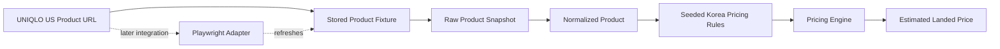
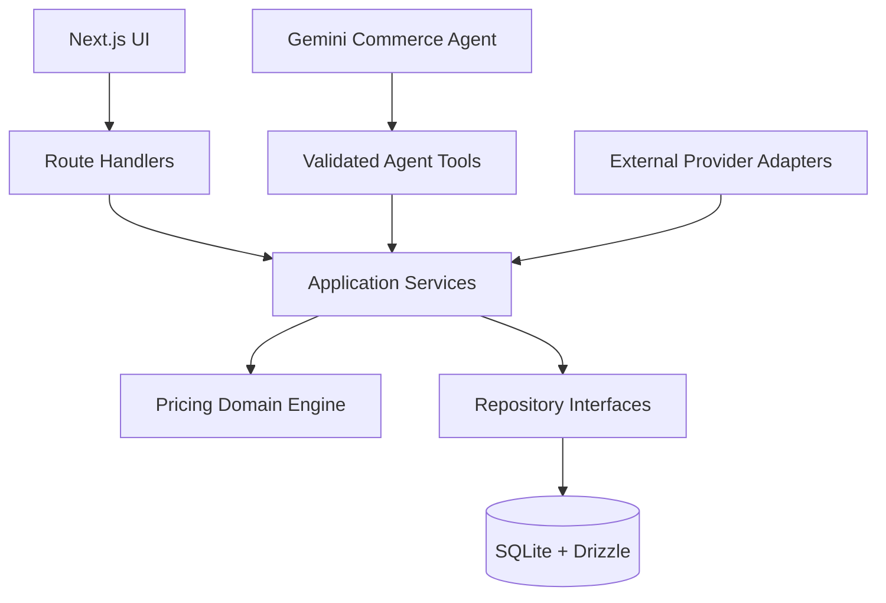
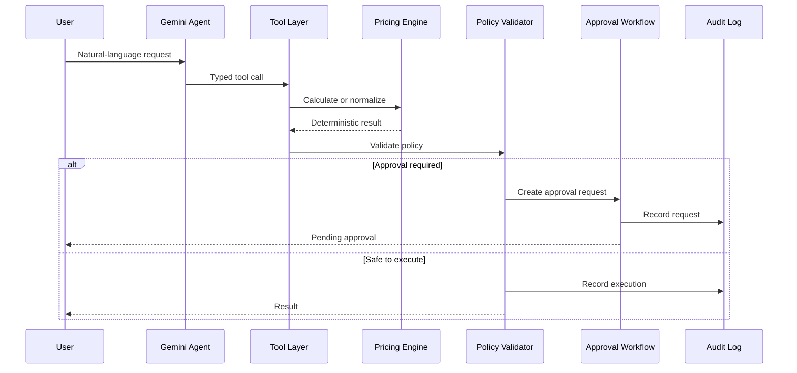
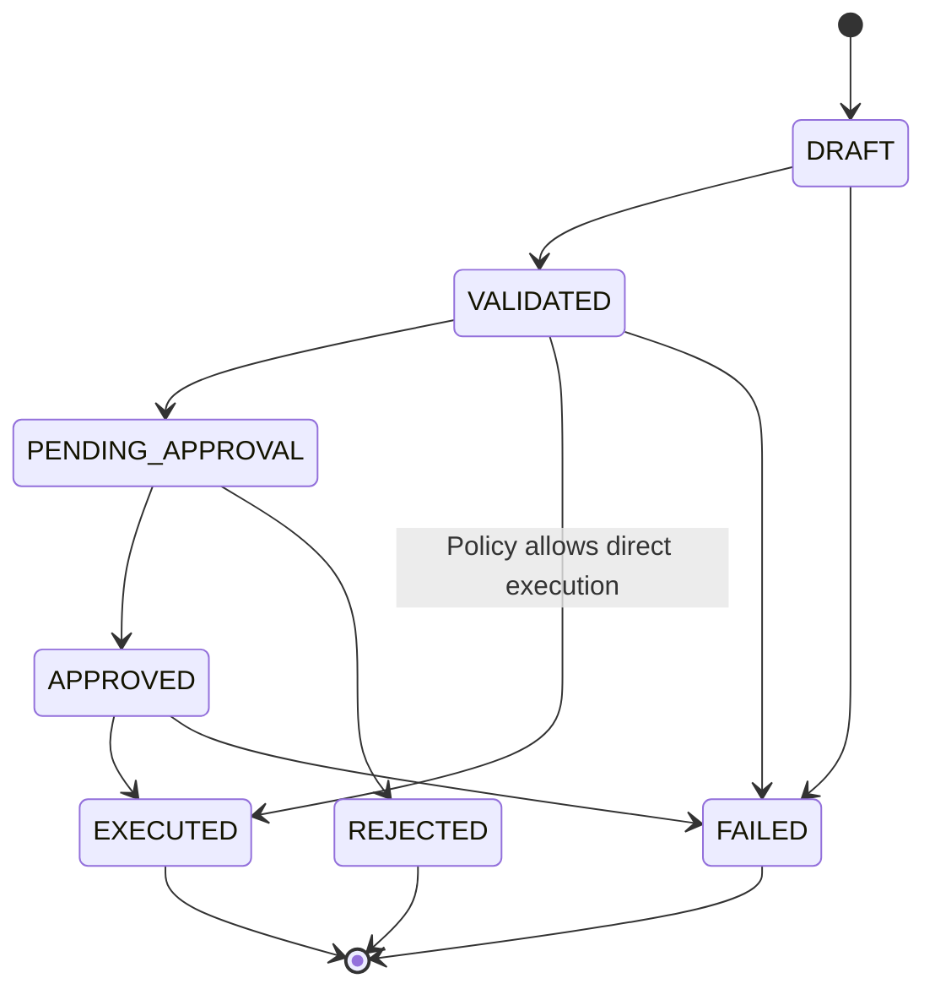
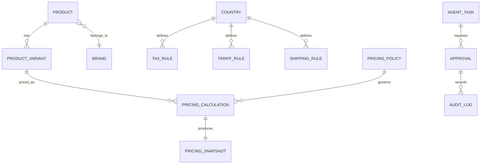

# Global AI Pricing — Implementation Plan

## 1. Project Objective

`global-ai-pricing` is a portfolio and interview-preparation project for a global fashion commerce platform.

The project demonstrates how to build:

- A deterministic global pricing engine
- A multi-country, multi-currency commerce interface
- An AI Commerce Agent using tool calling
- Human approval and auditability for AI-assisted operations
- A small but realistic product-development and experimentation workflow

The central design principle is:

> Pricing rules must be deterministic and auditable. AI may interpret requests, normalize data, suggest actions, and request approval, but it must not arbitrarily determine final prices or execute sensitive operations without policy validation.

The initial implementation will use SQLite and Drizzle ORM for speed and simplicity. Database access must be isolated so that PostgreSQL can be introduced later without redesigning the domain layer.

The AI layer will use the existing GCP Gemini API setup and the currently used lightweight Gemini Flash model. The model name and provider-specific code must be isolated behind an adapter so that the model can be changed later.

---

## 2. Target Product Scope

### 2.1 Initial user flow

1. The user enters or selects a product.
2. The user selects a source country and destination country.
3. The system loads exchange-rate, tax, tariff, shipping, and pricing-policy data.
4. The Pricing Engine calculates a recommended sale price.
5. The UI shows the result and a detailed calculation breakdown.
6. The AI Agent can normalize product information or request a price calculation through tools.
7. If a policy threshold is exceeded, the system creates an approval request.
8. Approved actions are executed and recorded in the audit log.

### 2.2 Initial screens

- Global pricing dashboard
- Product input and product draft screen
- Country and currency selector
- Price comparison table
- Calculation breakdown and assumptions panel
- Pricing-policy and engine-version metadata panel
- AI Agent workspace
- Approval queue
- Audit-log viewer
- Basic experiment/event dashboard

The first screen should remain a usable dashboard or comparison tool rather than a marketing landing page.

### 2.3 One-product fixture-first vertical slice

To demonstrate a realistic external-data path without turning this project into a general-purpose crawler, implement the first vertical slice from a stored public-product fixture first. Add the Playwright scraper after the deterministic pricing flow is working from that fixture.

Recommended first product:

```text
Source: UNIQLO US
Product: Women's Cotton Oversized Short-Sleeve T-Shirt
Product ID: 456009
URL: https://www.uniqlo.com/us/en/products/E456009-000/00
Source market: United States
Destination market: Korea
```

This product is a good first target because the public product page exposes a relatively small and understandable set of fields:

- Product name
- Product ID
- Price and USD currency
- Product material
- Production country
- Shipping fee and free-shipping threshold
- Availability and product description

The current price must not be hard-coded as a business rule. The initial fixture should preserve the observed price, currency, source URL, source timestamp, and raw extracted fields. The later scraper should capture the price at run time and persist the collection timestamp. Product availability, price, shipping, and page structure may change.

The first vertical slice will load the stored public-product fixture, normalize the result, combine it with seeded exchange-rate, tariff, VAT, and domestic-shipping rules, and display a transparent estimated landed price for Korea. The Playwright scraper is an integration demonstration added after this fixture-based path is stable.

The first product must be treated as the first instance of a generalized product-ingestion and pricing flow, not as a UNIQLO-only special case. Product-specific identifiers, source-page quirks, and brand-specific extraction details should remain in fixtures, normalization code, and scraper adapters. The Pricing Engine must only depend on explicit pricing inputs and must not contain product-ID-specific or retailer-specific branches.

The project should describe this as an **estimated calculation**, not as an official customs determination. Apparel tariff treatment may depend on classification, material, origin, value, and applicable trade rules.



The first scraper must not attempt to collect wholesale prices, login-only data, checkout data, customer data, or data from multiple sites. Wholesale pricing is often unavailable publicly and would add unnecessary authentication, contractual, and data-quality complexity.

---

## 3. Technology Baseline

### Frontend

- Next.js
- React
- TypeScript with strict mode
- Tailwind CSS
- shadcn/ui
- lucide-react
- `next-intl` or the existing i18n implementation
- React Hook Form where form complexity justifies it
- TanStack Query where server-state management is needed
- URL-based state for filters, country, currency, and comparison settings where practical

### Backend and application layer

- Next.js Route Handlers initially
- TypeScript application services
- Zod for request and response validation
- Provider and adapter interfaces for external services

### Database

- SQLite for the initial prototype
- Drizzle ORM
- Drizzle migrations
- Seed data for countries, currencies, products, tax rules, shipping rules, exchange rates, and policies

The database layer must not leak into the domain layer. The intended future migration path is:

```text
SQLite + Drizzle
        ↓
PostgreSQL + Drizzle
```

### AI

- GCP Gemini API
- Existing lightweight Gemini Flash model configuration
- Tool calling / function calling
- Provider adapter isolating Gemini-specific code

Suggested abstraction:

```ts
interface LlmProvider {
  generate(input: AgentInput, tools: AgentTool[]): Promise<AgentResponse>
}
```

The model name must be configured through an environment variable and must not be hard-coded throughout the application.

### Testing and operations

- Vitest for domain and application tests
- Playwright for critical browser flows
- Structured application logging
- Sentry or an equivalent error-reporting adapter later
- PostHog or a small internal event table for initial product analytics

Production build and deployment are manual and must not be run automatically during ordinary feature work.

---

## 4. Architecture

The application should follow a layered structure:

```text
UI / Next.js pages
        ↓
Route handlers / server actions
        ↓
Application services
        ↓
Domain services
        ↓
Repository interfaces
        ↓
Drizzle repositories
        ↓
SQLite
```

The AI Agent must call application tools rather than directly manipulating the database.

### 4.1 System architecture



The Agent and the UI share application services, but neither is allowed to bypass domain validation or repositories.

```text
User request
    ↓
Gemini Agent
    ↓
Validated tool call
    ↓
Application service
    ↓
Pricing Engine or commerce workflow
    ↓
Policy validation
    ↓
Approval when required
    ↓
Execution
    ↓
Audit log
```

### 4.2 Suggested project structure

```text
src/
  app/
    [locale]/
      dashboard/
      pricing/
      agent/
      approvals/
      audit-logs/
  components/
  domain/
    pricing/
      calculate-price.ts
      money.ts
      exchange-rate.ts
      tax-rules.ts
      tariff-rules.ts
      shipping-rules.ts
      pricing-policy.ts
      types.ts
  application/
    pricing/
    products/
    approvals/
    agent/
  infrastructure/
    scraping/
      types.ts
      product-scraper.ts
      uniqlo-us-scraper.ts
      selectors.ts
      scraper-errors.ts
    db/
      schema.ts
      client.ts
      repositories/
      seed.ts
    llm/
      llm-provider.ts
      gemini-provider.ts
    external/
      exchange-rate-provider.ts
      shipping-provider.ts
      payment-provider.ts
      partner-catalog-provider.ts
  agent/
    tools/
    prompts/
    executor.ts
  lib/
    validation/
    i18n/
    events/
```

The exact directory names may change, but domain logic, application logic, infrastructure, and UI responsibilities must remain distinguishable.

### 4.3 Agent execution flow



---

## 5. Pricing Engine

### 5.1 Pricing inputs

The engine should accept explicit, versioned inputs:

```ts
type PricingInput = {
  productCost: Money
  sourceCountry: CountryCode
  destinationCountry: CountryCode
  shippingCost: Money
  tariffRate: Rate
  vatRate: Rate
  exchangeRate: ExchangeRate
  paymentFeeRate: Rate
  targetMarginRate: Rate
  discountRate?: Rate
  pricingPolicyVersion: string
}
```

### 5.2 Pricing outputs

The result must contain more than a final number.

```ts
type PricingResult = {
  recommendedPrice: Money
  breakdown: PriceComponent[]
  assumptions: PricingAssumption[]
  warnings: PricingWarning[]
  engineVersion: string
  policyVersion: string
  calculatedAt: string
}
```

### 5.3 Required calculation concepts

- Decimal arithmetic; do not use JavaScript floating-point arithmetic for money
- Currency-aware formatting and minor-unit rules
- Explicit order of tariff and VAT calculation
- Exchange-rate basis and timestamp
- Shipping-cost rules
- Margin and discount rules
- Country-specific rounding
- Tax-free or duty-free thresholds
- Calculation warnings when data is missing or approximate
- Versioned pricing policies
- Reproducible calculation snapshots

The UI must show the calculation basis, not only the final recommended price.

### 5.4 Pricing test cases

At minimum, cover:

- Korea, Japan, and United States destinations
- Multiple source currencies
- Exchange-rate changes
- Duty-free threshold
- High-value product
- Free and paid shipping
- Different margin policies
- Discount application
- Currency rounding
- Missing or stale exchange-rate data
- Policy-version changes

---

## 6. Initial Database Model

The first schema should be intentionally small. Start with the core tables needed to calculate, display, snapshot, approve, and audit the first pricing flow:

- `products`
- `brands`
- `product_variants`
- `countries`
- `currencies`
- `exchange_rates`
- `tax_rules`
- `tariff_rules`
- `shipping_rules`
- `pricing_policies`
- `pricing_calculations`
- `pricing_snapshots`
- `approvals`
- `audit_logs`

Add these later, after the core pricing and approval flow is demonstrable:

- `agent_tasks`
- `events`

### 6.1 Important persistence rules

- Preserve the original external product payload in JSON where appropriate.
- Store calculation inputs and outputs as a reproducible snapshot.
- Store engine and policy versions with every calculation.
- Store actor, timestamp, action, and before/after values in audit logs.
- Use stable IDs and timestamps.
- Use an idempotency key for operations that may be retried.

SQLite-specific implementation shortcuts are allowed in infrastructure code only. Business rules must remain portable.

---

## 7. AI Commerce Agent

### 7.1 Initial tools

Implement tools in this order:

1. `normalize_product_data`
2. `calculate_price`
3. `request_price_approval`
4. `create_product_draft`
5. `suggest_category`
6. `update_product_price`
7. `create_order_draft`

The first milestone only needs the first three tools.

### 7.2 Tool rules

- Every tool has a Zod input schema.
- Every tool returns a typed result.
- Tools call application services, not raw database queries.
- The Agent must not use text-to-SQL to generate executable database queries.
- Database reads and writes must go through application services and repository interfaces, with authorization, validation, policy checks, and audit logging applied outside the LLM.
- Pricing tools use the deterministic Pricing Engine.
- Sensitive mutations require policy validation.
- Mutations must be idempotent where possible.
- The agent must distinguish proposal from execution.
- Tool calls and their results must be logged.

### 7.3 Agent behavior

The Agent may:

- Interpret a natural-language request
- Extract product and destination information
- Normalize product data
- Request a price calculation
- Explain a calculation result
- Suggest an action
- Create an approval request

The Agent may not:

- Invent tax or tariff rates
- Bypass the Pricing Engine
- Directly modify pricing tables
- Execute high-risk actions without approval
- Present an uncertain calculation as a confirmed price

---

## 8. Approval and Audit Workflow

### 8.1 State model

```text
DRAFT
  → VALIDATED
  → PENDING_APPROVAL
  → APPROVED
  → EXECUTED

Any executable state may transition to FAILED.
```

The implementation must validate allowed state transitions on the server.



### 8.2 Example approval policies

- Price change above 10% requires approval.
- Margin below the minimum policy requires approval or rejection.
- Missing tax or tariff data blocks execution.
- New product category suggestions require review.
- Order and settlement changes require an audit entry.

The approval screen should show:

- Requested action
- Agent reasoning summary
- Input data
- Calculation result
- Policy warnings
- Requesting actor
- Approve and reject actions
- Full audit history

### 8.3 Core data relationships



---

## 9. Globalization and UI Requirements

Support these locales initially:

```text
ko / en / ja / zh / ar
```

Use `ja` for Japanese and `zh` for Chinese as language codes. A country code such as `cn` may still be used separately when representing a market.

Required behavior:

- Locale-aware routes
- Shared translation keys
- Locale-aware number and currency formatting
- Currency selection independent from language selection
- Date and time-zone formatting
- Arabic RTL layout
- RTL-aware directional icons and table behavior
- Long translated strings must not break controls or tables
- Mobile comparison cards when tables become too dense

The design language remains Neo Brutal Data Utility:

- Strong 1px or 2px borders
- Compact, readable data panels
- Small corner radii
- Restrained shadows
- Neutral base palette
- Teal or blue-teal trust accent
- Consistent success, warning, and danger colors
- Tables as first-class UI

Do not introduce unrelated visual refactors.

---

## 10. Product Analytics and Experiments

Track initial events such as:

- `price_viewed`
- `price_comparison_opened`
- `calculation_breakdown_opened`
- `agent_suggestion_approved`
- `agent_suggestion_rejected`
- `product_draft_created`
- `checkout_started`

Implement one simple experiment:

- Strategy A: lower customer-facing price
- Strategy B: higher target margin

The experiment layer must record the assigned variant and outcome. It does not need to be a production-grade experimentation platform.

---

## 11. External Service Adapters

Create interfaces before connecting real external services:

```ts
interface ExchangeRateProvider {}
interface TaxProvider {}
interface ShippingProvider {}
interface PaymentProvider {}
interface PartnerCatalogProvider {}
```

Initially use mock or seeded implementations. Later implementations can connect to real APIs without changing the domain engine.

Each adapter should define behavior for:

- Timeout
- Retry
- Stale data
- Partial failure
- Unavailable provider
- Response validation

### 11.1 Playwright scraping implementation

The scraper is an infrastructure adapter and must not contain pricing rules.

Suggested interface:

```ts
interface ProductScraper {
  source: string
  scrapeProduct(url: string): Promise<ScrapedProduct>
}
```

Suggested normalized result:

```ts
type ScrapedProduct = {
  sourceUrl: string
  sourceName: string
  productName: string
  productId?: string
  brand?: string
  price: {
    amount: string
    currency: string
  }
  shippingCost?: {
    amount: string
    currency: string
  }
  freeShippingThreshold?: {
    amount: string
    currency: string
  }
  originCountry?: string
  material?: string
  availability?: string
  description?: string
  scrapedAt: string
  adapterVersion: string
  rawData?: unknown
}
```

Playwright practice scope:

- Open the public product URL.
- Wait for the product content to be available.
- Extract product name, ID, price, currency, shipping, origin, material, and availability.
- Normalize text and monetary values.
- Save a raw snapshot and a screenshot for debugging.
- Fail clearly when a required selector is missing.
- Close the browser in all success and failure paths.
- Avoid repeated requests and use a conservative timeout.

Do not bypass authentication, CAPTCHA, access controls, or rate limits. Check the target site's terms and robots guidance before using the scraper. Collect only the minimum public product information needed for this demonstration. Do not collect personal, payment, or checkout data.

### 11.2 Scraped data and pricing data boundary

The scraper provides observed facts:

```text
Observed product price
Observed currency
Observed shipping information
Observed product origin or production information
Collection time
Source URL
```

The Pricing Engine provides modeled calculations:

```text
Exchange-rate conversion
Tariff estimate
VAT estimate
Domestic shipping estimate
Margin and rounding
Recommended or estimated landed price
```

This boundary prevents a scraper from silently becoming a source of unverified tax or tariff decisions.

### 11.3 Scraping evidence

For every successful collection, preserve:

- Source URL
- Collection timestamp
- Adapter version
- Raw extracted values
- Normalized values
- Screenshot path or object identifier
- Pricing-engine version
- Exchange-rate version
- Tax/tariff policy version
- Calculation result

If a source page changes or extraction fails, the system must show a stale or unavailable state rather than silently calculating from an incorrect value.

---

## 12. Development Milestones

### Milestone 1 — Foundation

- Confirm existing Next.js structure
- Configure environment variables
- Add SQLite and Drizzle
- Add migrations and seed data
- Establish domain/application/infrastructure boundaries

### Milestone 1A — One-product fixture slice

- Add a stored UNIQLO US product fixture for product ID `456009`.
- Add the `ScrapedProduct` type or equivalent normalized source-product type.
- Normalize the observed USD price and shipping data from the fixture.
- Save or seed the raw snapshot and collection metadata.
- Ensure domain tests depend on stored fixtures, not the live website.
- Display a clear source, timestamp, and stale-data warning in the UI.

The deterministic Pricing Engine and most automated tests must run against stored fixtures so that they remain stable when the external page changes. The live scraper is an integration demonstration and should not block the first end-to-end demo.

### Milestone 2 — Deterministic Pricing Engine

- Define Money, Rate, Currency, and Country types
- Implement the calculation pipeline
- Add policy and version concepts
- Add unit tests
- Expose a calculation result through a simple application service

### Milestone 3 — Pricing Dashboard

- Connect the UI to the pricing service
- Add country and currency controls
- Add comparison table
- Add breakdown and assumptions panel
- Add loading, error, and empty states

### Milestone 3A — One-product Playwright integration

- Add Playwright as an infrastructure dependency.
- Add the `ProductScraper` interface.
- Implement only the UNIQLO US product adapter for product ID `456009`.
- Extract the public product fields listed above.
- Normalize the observed USD price and shipping data.
- Save the raw snapshot and collection metadata.
- Add a manual or development-only scrape command.
- Keep the fixture-based path as the default for automated tests.

### Milestone 4 — Product Data and Persistence

- Add product draft flow
- Persist products and calculations
- Preserve source payloads
- Add calculation snapshots
- Add audit-log records

### Milestone 5 — AI Agent

- Add Gemini provider adapter
- Add tool schemas
- Implement `normalize_product_data`
- Implement `calculate_price`
- Implement `request_price_approval`
- Log prompts, tool calls, results, and failures without exposing secrets

### Milestone 6 — Approval Workflow

- Add approval state machine
- Add threshold policies
- Add approval queue
- Add approve/reject actions
- Add execution and failure states

### Milestone 7 — Globalization

- Add all five locales
- Add currency formatting
- Add Arabic RTL verification
- Test translated table and mobile layouts

### Milestone 8 — Product Operations

- Add events
- Add one A/B test
- Add basic operational metrics
- Add Playwright critical-path tests
- Add error handling and structured logs

### One-turn implementation units

The following units should be small enough for one focused implementation turn. Each unit should leave the repository in a coherent state with a clear verification step.

#### Unit 0 — Repository baseline check

Goal: understand the existing project shape before adding dependencies or files.

- Inspect package manager, Next.js version, TypeScript config, app directory, styling setup, and test setup.
- Record whether Tailwind, shadcn/ui, Drizzle, Vitest, Playwright, and i18n already exist.
- Do not refactor or install anything in this unit.

Regression / verification:

Agent can run:

- Summarize existing structure and the next safest setup step.

Needs maintainer/manual:

- None expected unless the implementation reveals an unclear product requirement.

#### Unit 1 — App and tooling foundation

Goal: establish the minimum app/tooling baseline required by the plan.

- Add or confirm TypeScript strict mode.
- Add or confirm Tailwind CSS and shadcn/ui setup.
- Add or confirm lint/test scripts.
- Add basic environment variable documentation.

Regression / verification:

Agent can run:

- Run the lightest available static check or explain why none exists yet.

Needs maintainer/manual:

- None expected unless the implementation reveals an unclear product requirement.

#### Unit 2 — Domain type skeleton

Goal: create the pricing domain vocabulary without implementing the full calculation.

- Add `Money`, `Rate`, `CurrencyCode`, `CountryCode`, `ExchangeRate`, `PricingInput`, `PricingResult`, and breakdown/warning/assumption types.
- Keep these types independent from Next.js, Drizzle, Gemini, and UI code.
- Add small constructor or validation helpers only if they reduce ambiguity.

Regression / verification:

Agent can run:

- Typecheck or add a minimal domain test that imports the types.

Needs maintainer/manual:

- None expected unless the implementation reveals an unclear product requirement.

#### Unit 3 — Decimal money utilities

Goal: make money calculations safe before writing pricing formulas.

- Add a decimal arithmetic library or project-approved decimal helper.
- Implement money addition, multiplication by rate, currency assertion, and formatting boundary helpers.
- Avoid JavaScript floating-point arithmetic for business money calculations.

Regression / verification:

Agent can run:

- Add tests for decimal precision, currency mismatch, and minor-unit formatting assumptions.

Needs maintainer/manual:

- None expected unless the implementation reveals an unclear product requirement.

#### Unit 4 — Seeded rule fixtures

Goal: create stable input data for the first calculation without a database dependency.

- Add fixture data for countries, currencies, exchange rate, Korea VAT, tariff estimate, shipping rule, and pricing policy.
- Include source timestamp and version identifiers where relevant.
- Mark customs/tariff results as estimates, not official determinations.

Regression / verification:

Agent can run:

- Add a test that loads the fixtures and validates required fields.

Needs maintainer/manual:

- Confirm that seeded tax, tariff, shipping, margin, and exchange-rate assumptions are acceptable for a portfolio demo.
- Confirm any legal or customs wording that should be shown as an estimate rather than official advice.

#### Unit 5 — UNIQLO product fixture

Goal: model the first public product source as stored sample data.

- Add a stored UNIQLO US product fixture for product ID `456009`.
- Preserve source URL, observed values, observed timestamp, adapter version, and raw extracted fields.
- Add a normalized source-product type if it was not added earlier.

Regression / verification:

Agent can run:

- Add a test that normalizes the fixture into the expected product shape.

Needs maintainer/manual:

- Confirm the chosen public product is still the intended first demonstration product.
- Confirm that stored sample data is acceptable for the initial demo instead of live collection.

#### Unit 6 — Pricing calculation pipeline

Goal: produce a deterministic estimated landed price from fixture inputs.

- Implement the first calculation pipeline: product cost, shipping, exchange-rate conversion, tariff estimate, VAT estimate, margin, and rounding.
- Return recommended price, breakdown, assumptions, warnings, engine version, policy version, and calculated timestamp.
- Keep the engine pure and independent from persistence, AI, and UI.

Regression / verification:

Agent can run:

- Add unit tests for the first Korea destination scenario and at least one rounding or stale-data warning case.

Needs maintainer/manual:

- Review whether the first calculation order and rounding policy match the intended portfolio narrative.
- Confirm visible caveats for estimated tariff/customs behavior.

#### Unit 7 — Pricing application service

Goal: expose pricing through a small server-side use case.

- Add an application service that loads fixture inputs and calls the pricing engine.
- Validate input parameters with Zod where external input is accepted.
- Validate normalized source-product inputs before calculation: missing product ID/name/source metadata should fail clearly, missing or unsupported price/currency should return a blocking state, and optional fields such as shipping, origin, material, availability, and description should become explicit warnings or documented fallbacks instead of being silently guessed.
- If product shipping is missing, use the seeded shipping rule only when the destination scenario supports it and include a warning that fixture/rule shipping was used. If origin or material is missing, keep tariff/customs behavior estimate-only and include a warning about reduced confidence.
- Return a UI-ready result shape without leaking infrastructure details.

Regression / verification:

Agent can run:

- Add a service-level test or a small route-handler test if the framework setup supports it.
- Add service-level tests for missing required product price/currency, missing shipping fallback, and missing origin/material warnings.

Needs maintainer/manual:

- None expected unless the implementation reveals an unclear product requirement.

#### Unit 8 — Minimal pricing UI

Goal: show the first end-to-end result on screen.

- Add a dashboard or pricing page under the locale-aware route structure.
- Show product, source market, destination market, recommended price, breakdown, assumptions, warnings, source timestamp, and policy/engine version.
- Follow `DESIGN.md`: Neo Brutal Data Utility, compact data panels, strong borders, dark mode, mobile responsiveness.

Regression / verification:

Agent can run:

- Run the dev server or render check if available.
- Inspect desktop and mobile layout when feasible.

Needs maintainer/manual:

- Review the screen visually for the intended Neo Brutal Data Utility style.
- Confirm that the displayed breakdown is understandable to non-engineering readers.

#### Unit 9 — Locale routing and translation shell

Goal: make the UI ready for five-language support without translating every string in the first pass.

- Add or confirm locale-aware routes for `ko`, `en`, `ja`, `zh`, and `ar`.
- Add shared translation keys for the pricing page shell.
- Ensure `ja` and `zh` are language routes, while `jp` and `cn` remain market/country codes only.
- Add basic RTL direction handling for Arabic.

Regression / verification:

Agent can run:

- Visit or test all locale routes.
- Check that Arabic route sets RTL direction.

Needs maintainer/manual:

- Review sample translations for tone and terminology.
- Confirm Arabic RTL layout manually if automated visual coverage is incomplete.

#### Unit 10 — Persistence schema skeleton

Goal: introduce database structure without mixing it into domain logic.

- Add Drizzle and SQLite setup if not already present.
- Define core tables only: products, brands, variants, countries, currencies, exchange rates, tax rules, tariff rules, shipping rules, pricing policies, pricing calculations, pricing snapshots, approvals, audit logs.
- Keep `agent_tasks` and `events` for later units.

Regression / verification:

Agent can run:

- Generate or run migrations in a development-safe way.
- Verify schema types compile.

Needs maintainer/manual:

- Confirm whether generated migration files should be committed at this stage.
- Confirm any table naming preference before later units depend on the schema.

#### Unit 11 — Calculation snapshot persistence

Goal: store enough data to reproduce a pricing result.

- Persist calculation input, output, engine version, policy version, source timestamp, and calculation timestamp.
- Store original external product payload where appropriate.
- Keep repository code behind interfaces.

Regression / verification:

Agent can run:

- Add a repository or application test that writes and reads one calculation snapshot.

Needs maintainer/manual:

- None expected unless the implementation reveals an unclear product requirement.

#### Unit 12 — Approval state machine

Goal: model approval transitions before wiring AI actions.

- Add approval states and server-side transition validation.
- Implement rules for approval-required, rejected, approved, executed, and failed states.
- Add policy examples such as price change above 10% and missing data blocking execution.

Regression / verification:

Agent can run:

- Add tests for allowed and rejected state transitions.

Needs maintainer/manual:

- None expected unless the implementation reveals an unclear product requirement.

#### Unit 13 — Audit logging

Goal: make important actions traceable.

- Add audit log writing for calculation creation, approval request, approval decision, execution, rejection, and failure.
- Include actor, action, timestamp, target, and before/after values where relevant.
- Avoid storing secrets or raw prompts that may contain sensitive data.

Regression / verification:

Agent can run:

- Add a test or local scenario that produces an audit trail for one approval flow.

Needs maintainer/manual:

- None expected unless the implementation reveals an unclear product requirement.

#### Unit 13A — Audit-log viewer UI

Goal: make audit trails visible in the product workflow.

- Add a locale-aware audit-log viewer route such as `/[locale]/audit-logs`.
- Show actor, action, timestamp, target, and before/after values in a compact operational table.
- Add a reusable audit-history panel for approval detail screens so each approval can show its full audit history.
- Keep sensitive values redacted and avoid exposing raw prompts or secrets.
- Preserve dark mode, mobile layout, and all five locale routes.

Regression / verification:

Agent can run:

- Add a component or route test where feasible, or run lint/type checks.
- Manually smoke the audit-log viewer route in at least the default locale.

Needs maintainer/manual:

- Confirm the final approval-detail screen placement when the approval queue UI is implemented.

#### Unit 14 — AI provider adapter skeleton

Goal: isolate Gemini-specific code before implementing agent behavior.

- Add `LlmProvider` interface.
- Add Gemini provider adapter with model name read from environment variables.
- Keep prompts, provider configuration, and tool execution separate.
- Do not let provider code call repositories or mutate domain state directly.

Regression / verification:

Agent can run:

- Add a mocked provider test or compile-time check using the interface.

Needs maintainer/manual:

- Provide or confirm real Gemini environment variables before any live provider call.
- Confirm that live API calls are allowed for the current task before running them.

#### Unit 15 — AI input context builder

Goal: prepare strongly organized model input.

- Build a context object from user request, product data, pricing rules, policy constraints, and allowed tools.
- Include explicit forbidden behavior such as inventing rates or bypassing approval.
- Keep context construction deterministic and testable.

Regression / verification:

Agent can run:

- Add a snapshot-style test or structured assertion for one user request.

Needs maintainer/manual:

- Review whether the model input includes enough business context without exposing unnecessary data.
- Confirm any prompt wording that represents project positioning or interview narrative.

#### Unit 16 — AI output harness

Goal: validate model output before any tool execution.

- Parse tool calls.
- Check tool name against the allowlist.
- Validate tool input with Zod.
- Route allowed calls to application services.
- Convert sensitive mutations into approval requests when required.

Regression / verification:

Agent can run:

- Add tests for valid tool calls, unknown tools, invalid input, and approval-required output.

Needs maintainer/manual:

- Review which tool calls should be treated as sensitive mutations.
- Confirm approval thresholds before the harness enforces them as policy.

#### Unit 17 — First three agent tools

Goal: implement the first useful AI tool set.

- Implement `normalize_product_data`.
- Implement `calculate_price`.
- Implement `request_price_approval`.
- Ensure tools return typed results and log tool calls/failures.

Regression / verification:

Agent can run:

- Add tests using mocked model output and fixture pricing data.

Needs maintainer/manual:

- Confirm the tool result wording shown to users.
- Confirm whether live model smoke testing is allowed or whether mocked tests are sufficient.

#### Unit 18 — Playwright scraper integration

Goal: add live product collection as an optional integration path.

- Add Playwright dependency and development-only scrape command.
- Implement only the UNIQLO US adapter for product ID `456009`.
- Extract public product fields, normalize values, save raw snapshot metadata, and close the browser on all paths.
- Do not bypass authentication, CAPTCHA, access controls, or rate limits.

Regression / verification:

Agent can run:

- Run the manual scrape command only when appropriate.
- Keep automated tests fixture-based.

Needs maintainer/manual:

- Confirm that checking the target site's terms, robots guidance, and acceptable-use constraints has been completed.
- Confirm live scraping is appropriate before running the manual scrape command.
- Visually inspect a saved screenshot if extraction selectors change or confidence is low.

#### Unit 19 — Product events

Goal: add lightweight product analytics after the core flow works.

- Add event recording for price viewed, breakdown opened, approval approved/rejected, and product draft created.
- Store assigned experiment variant only after a minimal event table exists.
- Keep analytics out of pricing decisions.
- Stop at the local event table, repository, and service layer in this unit; wire the first UI interactions in Unit 20 so analytics remains verifiable through the final user flow.

Regression / verification:

Agent can run:

- Add a local scenario or test that records one event without affecting calculation output.
- Confirm the event service can record `product.price_viewed` with an optional experiment variant and redacted metadata.

Needs maintainer/manual:

- Confirm event names and which user interactions matter for the portfolio story.
- Confirm analytics data should remain local/internal and not use an external provider yet.

#### Unit 20 — End-to-end critical path

Goal: verify the main story from UI input to output.

- Add a Playwright test or manual verification script for the pricing dashboard.
- Cover product fixture loading, destination selection, price result display, breakdown opening, and warning visibility.
- Expose the Playwright integration status in the UI without turning scraping into an unsafe public action:
  - show that the current dashboard is fixture-backed and deterministic;
  - show that the UNIQLO US Playwright adapter exists as a maintainer-run integration path;
  - display the development command name, such as `pnpm scrape:uniqlo-us`, as read-only operational context;
  - avoid a public "scrape remote page now" button unless terms, rate limits, failure handling, and operator controls are explicitly approved.
- Add the minimal product-events connection needed for the portfolio story:
  - record `product.price_viewed` when the pricing page is viewed;
  - record `product.breakdown_opened` when the user opens the breakdown;
  - keep both event writes local/internal and outside the pricing calculation path.
- Prefer a small API route or server action for event writes, plus a focused client component only where user interaction is required.
- Include one mobile or narrow viewport check.

Regression / verification:

Agent can run:

- Run the critical-path test or document any blocker clearly.
- Verify the product event write path records at least one UI-triggered event without changing the displayed pricing result.

Needs maintainer/manual:

- Manually review the final user flow for clarity, especially pricing caveats and approval behavior.
- Confirm whether the demo is ready to be shown as a portfolio/interview walkthrough.

#### Unit 21 — Scrape run model

Goal: add a durable execution record for every scraper worker attempt.

- Add a `scrape_runs` table to record worker execution boundaries:
  - `id`;
  - `adapter_name`;
  - `adapter_version`;
  - `target_source`;
  - `target_product_id`;
  - `target_url`;
  - `status`;
  - `started_at`;
  - `finished_at`;
  - `error_code`;
  - `error_message`;
  - `metadata_json`.
- Use a small status vocabulary first: `started`, `succeeded`, `failed`, and `partial`.
- Keep error details short and operator-useful; never store secrets, full environment files, private keys, cookies, session storage, or authorization headers.
- Add indexes for recent run inspection by target and status.
- Add a repository with explicit methods such as:
  - `startRun`;
  - `markSucceeded`;
  - `markFailed`;
  - `findRecent`;
  - `findLatestByTarget`.
- Add an application service that owns scrape run lifecycle transitions and keeps transition timestamps consistent.
- Treat a run left in `started` for too long as stale only in a later scheduling/observability unit; do not overbuild recovery here.

Regression / verification:

Agent can run:

- Add repository tests for successful run creation and completion.
- Add repository tests for failed run completion with a redacted/summary error.
- Confirm run writes do not require Playwright or live network access.

Needs maintainer/manual:

- Confirm the status vocabulary is sufficient for the first production-like worker story.
- Confirm how much non-sensitive diagnostic metadata should be retained.

#### Unit 22 — Source product snapshot model

Goal: store external product observations so price changes can be displayed over time.

- Add a `source_product_snapshots` table or an equivalently named product observation table.
- Store at minimum:
  - `id`;
  - `scrape_run_id`;
  - `source_name`;
  - `source_market_code`;
  - `source_url`;
  - `external_product_id`;
  - `product_name`;
  - `brand`;
  - `raw_price_amount`;
  - `raw_price_currency_code`;
  - `normalized_price_amount_minor`;
  - `normalized_price_currency_code`;
  - `availability`;
  - `observed_at`;
  - `adapter_version`;
  - `raw_payload_json`;
  - `created_at`.
- Keep raw payloads useful but bounded; do not store browser state, cookies, local storage, credentials, or full screenshots in the row.
- Link each snapshot to the scrape run that produced it.
- Add repository methods for:
  - inserting a snapshot;
  - finding the latest snapshot by source/product;
  - finding the previous snapshot before a given observation;
  - finding recent snapshot history for a product.
- Add a small diff helper for source product snapshots, limited to product price, currency, availability, and observed timestamp.
- Preserve deterministic fixture tests by using seeded/mocked observations.

Regression / verification:

Agent can run:

- Add repository tests for insert and latest lookup.
- Add tests for previous snapshot lookup and price delta detection.
- Confirm snapshot persistence handles missing optional product fields without blocking price history.

Needs maintainer/manual:

- Confirm the table name and how long raw payload JSON should be retained.
- Confirm whether screenshots/debug artifacts should be file-based rather than database-backed.

#### Unit 23 — Worker command skeleton

Goal: create a scraper worker entrypoint that is separate from the Next.js request lifecycle.

- Add `scripts/workers/scrape-products.ts`.
- Add a package script such as `pnpm worker:scrape-products`.
- Make the worker runnable from shell, cron, PM2, Docker, or a future AWS scheduler.
- Default the first target to the UNIQLO US product fixture story:
  - source: `UNIQLO US`;
  - product ID: `456009`;
  - URL: `https://www.uniqlo.com/us/en/products/E456009-000/00`.
- Support a `--dry-run` mode that exercises target resolution and run lifecycle setup without storing live product snapshots.
- Support an explicit target argument or environment variable for future extension, but avoid building a broad crawler.
- Start a scrape run before executing target work and always mark the run succeeded or failed before exit.
- Use process exit codes consistently:
  - `0` for completed success;
  - non-zero for failed worker execution.
- Keep the worker outside UI-triggered public actions.

Regression / verification:

Agent can run:

- Add a worker test or local scenario using a mocked adapter.
- Confirm a failed adapter still marks the scrape run failed.
- Confirm `--dry-run` does not insert product snapshots.

Needs maintainer/manual:

- Confirm whether the first worker should handle one target only or a small allowlisted list.
- Confirm the initial schedule interval that later PM2/cron configuration should use.

#### Unit 24 — UNIQLO adapter persistence

Goal: persist the existing UNIQLO US Playwright adapter output as source product snapshots.

- Connect the existing UNIQLO US adapter to the worker command.
- Convert adapter output into the source product snapshot shape from Unit 22.
- Preserve adapter version and source observed timestamp.
- Persist the raw extraction payload after sanitization and size control.
- Ensure browser cleanup runs on every path, including timeout and extraction failure.
- Record a failed scrape run when adapter execution fails.
- Record a succeeded scrape run only after all required snapshot writes have completed.
- Keep live scraping as a maintainer-run integration path; do not add a public scrape button.
- Do not bypass authentication, CAPTCHA, access controls, rate limits, or target-site restrictions.

Regression / verification:

Agent can run:

- Add automated tests around adapter-output-to-snapshot mapping using fixtures.
- Add a mocked worker integration test that writes one snapshot from an adapter result.
- Keep live Playwright execution manual unless explicitly approved.

Needs maintainer/manual:

- Confirm target-site terms, robots guidance, and acceptable-use constraints before live worker execution.
- Confirm whether live scrape artifacts should include screenshots for debugging.

#### Unit 25 — Snapshot-based pricing service

Goal: extend pricing from fixture-only input to latest collected source snapshots.

- Add a pricing service path that reads the latest source product snapshot for a target product.
- Convert source product snapshots into the existing normalized product shape used by the Pricing Engine.
- Include snapshot identifiers in calculation input metadata:
  - `source_product_snapshot_id`;
  - `scrape_run_id`;
  - `source_observed_at`.
- If no collected snapshot exists, return either a blocked state or a clearly labeled fixture fallback, based on the existing page/demo requirements.
- Add source freshness warnings:
  - no snapshot;
  - stale snapshot;
  - latest scrape failed but a previous successful snapshot exists.
- Keep all pricing math inside the existing deterministic Pricing Engine.
- Ensure scraping failures never directly mutate a displayed price.

Regression / verification:

Agent can run:

- Add service tests for latest-snapshot pricing success.
- Add service tests for no snapshot, stale snapshot, and previous-success fallback.
- Confirm calculation output remains reproducible from stored snapshot and policy versions.

Needs maintainer/manual:

- Confirm the stale threshold for product source data.
- Confirm fixture fallback wording and whether fallback should remain visible in portfolio demos.

#### Unit 26 — Pricing calculation history

Goal: store and compare pricing calculation history produced from product snapshots.

- After a worker stores a source product snapshot, run the pricing service and persist a calculation snapshot.
- Link pricing calculations to source snapshot/run metadata.
- Add helpers for:
  - source price delta;
  - recommended price delta;
  - currency-aware percentage change;
  - changed/unchanged direction.
- Add repository methods for latest calculation and recent calculation history by product/source.
- Preserve a clear distinction between:
  - source product observation history;
  - pricing calculation history;
  - product analytics events.
- Keep analytics events out of pricing decisions and history calculations.

Regression / verification:

Agent can run:

- Add tests for writing a calculation after a mocked snapshot.
- Add tests for delta helpers, including unchanged price and currency mismatch handling.
- Confirm repeated same-price observations do not create misleading "price changed" results.

Needs maintainer/manual:

- Confirm whether every scrape should produce a pricing calculation or only changed snapshots should.
- Confirm how many historical rows should be shown in the UI by default.

#### Unit 27 — Dashboard latest data mode

Goal: make the pricing dashboard read latest collected data while clearly labeling data freshness.

- Update the pricing page/service boundary to request latest snapshot-backed pricing where available.
- Display a data mode label:
  - `latest collected snapshot`;
  - `fixture fallback`;
  - `stale snapshot`;
  - `blocked`.
- Display last collected time, last successful scrape run, adapter version, and source observed timestamp near the relevant pricing result.
- Keep the Playwright command visible only as read-only operational context.
- Do not expose a public "scrape now" button.
- Show source freshness warnings alongside pricing caveats.
- Preserve dark mode, mobile responsiveness, and all five supported languages.
- Account for Arabic RTL in the status and metadata layout.

Regression / verification:

Agent can run:

- Add a page/service test or local scenario for latest snapshot mode.
- Add a fallback scenario with no snapshot.
- Run lint/type/test checks.
- When feasible, verify narrow viewport assumptions with the critical-path script.

Needs maintainer/manual:

- Manually review data mode wording in Korean and English first.
- Confirm whether stale data should be warning severity or blocking severity.

#### Unit 28 — Price change history UI

Goal: show users how source prices and recommended prices changed over time.

- Add a compact history section to the pricing dashboard.
- Show recent observations/calculations with:
  - observed time;
  - source price;
  - recommended price;
  - source price delta;
  - recommended price delta;
  - data source/run status.
- Use badges for up/down/unchanged movement.
- Use a table on desktop and compact cards on mobile if the table becomes too dense.
- Keep raw payload JSON out of the default UI.
- Add a focused detail view only if needed for source metadata; do not overbuild a full admin console.
- Add i18n keys for Korean, English, Japanese, Chinese, and Arabic.

Regression / verification:

Agent can run:

- Add component/page tests or fixture-backed rendering checks for history rows.
- Verify long translated labels do not overflow compact cards or badges.
- Verify Arabic RTL alignment assumptions where feasible.

Needs maintainer/manual:

- Confirm whether users should see failed scrape attempts in the main history or only in operational health.
- Confirm default history depth, such as 10 recent observations.

#### Unit 29 — Worker scheduling contract

Goal: define the scheduling behavior needed before binding it to PM2, cron, systemd, or AWS.

- Add a scheduling contract for `worker:scrape-products`.
- Define environment variables:
  - `DATABASE_URL`;
  - target product IDs or allowlist path;
  - scrape timeout;
  - dry-run flag;
  - stale-run threshold;
  - optional artifact directory.
- Add active-run or lock protection so overlapping worker executions do not scrape the same target concurrently.
- Add stale run recovery rules:
  - how old `started` runs are treated;
  - whether the next run may mark them failed;
  - what metadata is retained.
- Define exit code behavior for scheduler integration.
- Decide whether the first scheduler implementation should use PM2 inside a worker container or host-level cron/systemd.
- Keep the contract scheduler-agnostic where possible.

Regression / verification:

Agent can run:

- Add tests for overlapping run prevention.
- Add tests for stale run detection or document why it is deferred.
- Confirm worker exits with non-zero status on unrecoverable failure.

Needs maintainer/manual:

- Choose PM2, host cron/systemd, or AWS EventBridge/ECS for the first production-like scheduler.
- Confirm the initial scrape interval and acceptable target-site request rate.

#### Unit 30 — Worker runtime image

Goal: prepare a Docker runtime capable of running Playwright scraping on AWS.

- Add a worker-specific Dockerfile or build target.
- Include Playwright and Chromium runtime dependencies.
- Prefer keeping the web runtime lean and the worker runtime browser-capable.
- Ensure the worker image can run:
  - `pnpm worker:scrape-products --dry-run`;
  - a browser launch smoke check;
  - a fixture/mocked scrape path.
- Add an artifact directory for screenshots or debug captures when adapter confidence is low.
- Do not include secrets, credentials, or generated private files in the image.
- Document or script read-only AWS smoke checks for `t3a`.
- Keep live target scraping behind maintainer approval.

Regression / verification:

Agent can run:

- Build the worker image only when explicitly allowed by the maintainer, because production-like image builds may be heavy.
- Add local Dockerfile syntax/static checks where feasible.
- Add a script-level smoke check that verifies Playwright can launch Chromium.

Needs maintainer/manual:

- Confirm whether to use the official Playwright base image or install browser dependencies in the existing Node image.
- Confirm AWS instance resource limits for Chromium worker execution.

#### Unit 31 — Operational observability

Goal: make scraper and pricing pipeline health visible to maintainers.

- Add service/repository helpers for operational health:
  - last successful scrape;
  - last failed scrape;
  - consecutive failures;
  - latest snapshot age;
  - latest calculation age.
- Add a dashboard data-health panel or maintainer-facing section.
- Show stale data clearly while continuing to display the last known good price when possible.
- Keep failure summaries short and non-sensitive.
- Add audit or product-event records for worker milestones only if they clarify the portfolio story and do not duplicate scrape run records.
- Do not expose raw environment, cookies, request headers, or browser state.

Regression / verification:

Agent can run:

- Add tests for health summary calculation.
- Add UI fixture scenarios for healthy, stale, and failing pipeline states.
- Verify failed scrape summaries do not leak sensitive keys through metadata sanitization.

Needs maintainer/manual:

- Confirm what health state should appear to public viewers versus maintainers only.
- Confirm whether operational health belongs on the pricing dashboard or a separate route.

#### Unit 32 — Critical path E2E: live snapshot mode

Goal: verify the final story from scheduled collection to dashboard history without requiring unsafe live scraping in automated tests.

- Extend the critical-path verification script or add a new one for snapshot-backed pricing.
- Use a mocked or fixture scraper path to:
  - create a scrape run;
  - write a source product snapshot;
  - run pricing;
  - write a pricing calculation snapshot;
  - load the pricing page;
  - open the breakdown;
  - view price history.
- Include one mobile or narrow viewport check.
- Verify the displayed source price and recommended price match the stored snapshot/calculation.
- Verify opening the breakdown does not change displayed pricing output.
- Verify product event writes remain local/internal and outside pricing decisions.

Regression / verification:

Agent can run:

- Run the snapshot-mode critical path test or document blockers clearly.
- Run standard unit tests and lint/type checks.
- Verify the latest snapshot and history UI render with deterministic fixture data.

Needs maintainer/manual:

- Manually review the final walkthrough for portfolio/interview clarity.
- Confirm whether live UNIQLO scraping should be demonstrated manually after terms/rate-limit review.

#### Unit 33 — Two-container AWS deployment

Goal: plan and implement deployment scripts for separate web and worker containers on `t3a`.

- Inspect the current deployment scripts and Dockerfile layout before editing.
- Split deployment into two images:
  - `global-ai-pricing-web:<timestamp>`;
  - `global-ai-pricing-worker:<timestamp>`.
- Keep the web container focused on Next.js dashboard/API serving:
  - public port mapping such as `3400:3000`;
  - no browser runtime unless required by shared dependencies.
- Keep the worker container focused on scheduled scraping and snapshot pricing:
  - no public port;
  - Playwright/Chromium runtime included;
  - worker command or PM2-managed scheduled command as entrypoint.
- Decide and document the shared persistence/env strategy:
  - `DATABASE_URL`;
  - SQLite volume or future PostgreSQL connection;
  - artifact directory;
  - non-secret runtime configuration.
- If PM2 remains the chosen scheduler, add a worker-specific ecosystem config and run it with `pm2-runtime`.
- Preserve rollback by timestamp-tagging images and avoiding automatic image pruning.
- Update deploy scripts so web replacement and worker replacement are separable.
- Add read-only post-deploy verification steps:
  - `docker ps`;
  - recent web logs;
  - recent worker logs;
  - web health/page response;
  - latest scrape run state.
- Do not create/modify SSH keys.
- Do not print secrets, full env files, credentials, cookies, or private keys in logs or final responses.
- Do not deploy automatically unless the maintainer explicitly asks for deployment.

Regression / verification:

Agent can run:

- Run script syntax checks and local dry-run checks where supported.
- Inspect generated Docker commands without executing destructive container replacement unless explicitly approved.
- Verify that worker container configuration does not expose public ports.

Needs maintainer/manual:

- Confirm PM2-in-worker versus host scheduler before finalizing runtime behavior.
- Confirm final container names, port mapping, volume path, and rollback policy.
- Approve actual deployment to `t3a`.

---

## 13. Environment Configuration

Use environment variables for secrets and replaceable providers.

Suggested variables:

```env
DATABASE_URL=file:./data/global-ai-pricing.db
GOOGLE_APPLICATION_CREDENTIALS=./gcp-key.json
GOOGLE_CLOUD_PROJECT=
GOOGLE_CLOUD_LOCATION=global
VERTEX_AI_MODEL_ID=gemini-3.6-flash
APP_BASE_URL=http://localhost:3000
```

Do not commit secrets, API keys, generated databases, or provider credentials.

---

## 14. Verification Checklist

### Domain

- Money calculations use decimal arithmetic.
- Same input and same policy version produce the same result.
- Missing data produces a warning or a blocked state.
- Calculation results are reproducible from stored snapshots.

### API and persistence

- All external input is validated.
- Database operations are isolated in repositories.
- Mutating operations are idempotent where relevant.
- Audit logs contain actor, action, timestamp, and before/after values.

### Agent

- Agent tools have typed schemas.
- Agent cannot bypass the Pricing Engine.
- Sensitive operations require approval.
- Tool calls and failures are traceable.

### UI

- Light mode
- Dark mode
- Desktop
- Narrow desktop
- Mobile
- Korean, English, Japanese, Chinese, and Arabic
- Arabic RTL
- Long translated strings
- Dense pricing tables and calculation breakdowns

### Product behavior

- Product draft to price calculation
- Price calculation to approval request
- Approval to execution
- Rejection and failure handling
- Event tracking

---

## 15. Portfolio and Interview Narrative

The project should be presented as a focused technical prototype, not as a claim that it reproduces Fetching's internal system.

Recommended description:

> Global AI Pricing is a cross-border commerce prototype that combines a deterministic, auditable pricing engine with an AI-assisted commerce workflow. It models exchange rates, tariffs, VAT, shipping, margins, and currency rules for multiple markets. Gemini-based tools normalize product data, request pricing calculations, and create approval workflows, while final pricing decisions remain governed by explicit policies and calculation snapshots.

Interview points to prepare:

- Why pricing must not be delegated entirely to an LLM
- Why money requires decimal arithmetic
- How country-specific rules are modeled and versioned
- How SQLite can later migrate to PostgreSQL
- How the Agent is separated from domain logic
- How approvals and audit logs reduce operational risk
- How a common commerce core supports Korea, Japan, and the United States
- How the one-week product cycle is reflected in measurable events and experiments

The project is successful when the architecture is understandable, the calculation is reproducible, the AI boundary is explicit, and the main user flow can be demonstrated end to end.
